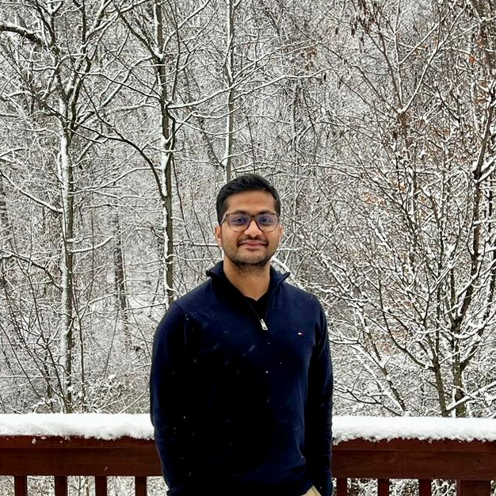

## About Me {#aboutme}

I am a second year Computer Science Ph.D. student in Boston University.
I am a member of the [Kolachalama
Laboratory](https://vkola-lab.github.io) working under the supervision
of [Dr. Vijaya Kolachalama](https://www.bu.edu/cs/profiles/vkola/).

I go by "Subh", pronounced as "Shoobh".
<nav>
    <a href="assets/docs/cv.pdf">
    <button>
    <i class="fa fa-file-pdf-o" aria-hidden="true"></i> CV
    </button>
    </a>
</nav>

## Research

I mostly spend my time designing and developing machine learning models
to aid biomedical applications. My research interests fall under the
umbrella of multimodal representation learning.

However, I am still on the exploration journey <i class="fa fa-road" aria-hidden="true"></i> to find my niche. I would
be happy to talk more on anything related:

Topics of interest

* Intersection of video and language understanding.
* Are models capable of continually learning new tasks on videos?
* Can we stop training to align embeddings from different off-the-shelf foundation models?

------------------------------------------------------------------------

## News

* <i class="fa fa-headphones" aria-hidden="true"></i> Jul\'24: [PODGPT](https://podgpt.org){.inline-image}: An audio-augmented LLM is live!
* <i class="fa fa-file-o" aria-hidden="true"></i> Jul\'24: Our work on audio-augmented large language model is on [medRxiv](https://doi.org/10.1101/2024.07.11.24310304).
* <i class="fa fa-id-badge" aria-hidden="true"></i> Sep\'23: Started as a CS Ph.D. student at Boston University.

## Teaching

* <i class="fa fa-pencil-square-o" aria-hidden="true"></i> Fall\'23: Teaching Fellow: CS 112 Introduction to Computer Science

## Projects

An incomplete `tree` of academic projects:

<ul class="tree"><li>
<strong>research</strong>

* Comparative evaluation of deep learning models for multi-domain medical image classification
    * [report](assets/docs/ivc_project.pdf)\
    * [code](https://github.com/appledora/Multi-domain-Medical-Image-Classification/tree/main)\
    * [slides](assets/docs/ivc_project_slides.pdf)\
* Rule-based Hand Gesture Recognition\
    * [report](assets/docs/ai_project.pdf)\
    * [code](https://github.com/appledora/Rule-based-gesture-detection)\

</li></ul>

<ul class="tree"><li>
<strong>course</strong>

* Object tracking with a Bayesian recursive filter and Hungarian algorithm
    * [code](https://github.com/SubhrangshuBit/ivc-a3/tree/main)\
* Quantitative tablet characterisation based on multi-component image analytics & pattern matching
    * [report](assets/docs/Master_Thesis.pdf)\
    * [slides](assets/docs/hyperspectral_image_quantification_drl.pdf)\
* Implementation of improved 2-order optimisation techniques
    * [report](assets/docs/OptAlg-Final.pdf)\
    * [code](https://github.com/SubhrangshuBit/Optimization---Conjugate-Gradient-/tree/main)\
* Zero inflated time series analysis of terrorism in India
    * [report](assets/docs/zero_inflated_time_series.pdf)\
* Comparative study of Bayesian estimators and maximum likelihood estimators
    * [report](assets/docs/Bayes_vs_MLE.pdf)\

</li></ul>

## Gallery
 

<!-- For aligning images -->
<!-- Solarized dark             |  Solarized Ocean
:-------------------------:|:-------------------------:
 |   -->

## Acknowledgements

This webpage template is inspired from this
[tweet](https://x.com/owickstrom/status/1828469089666298315).

The template source code developed by [Oskar
Wickström](https://wickstrom.tech) is here:
[The Monospace Web](https://github.com/owickstrom/the-monospace-web)

::: debug-grid
:::
